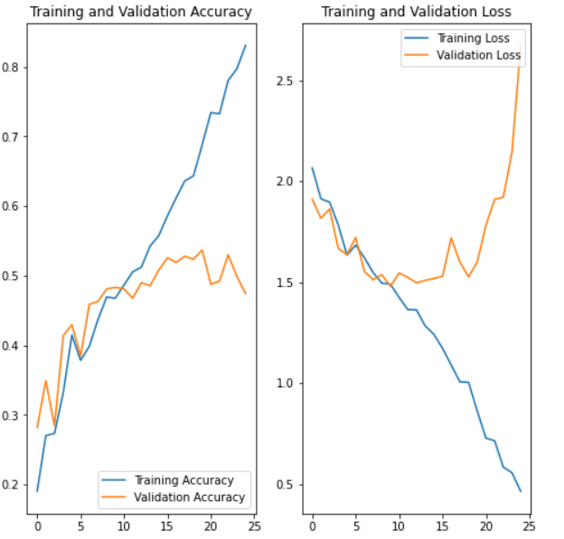
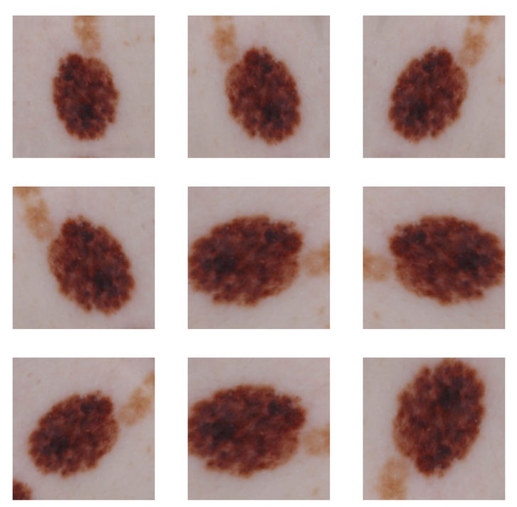
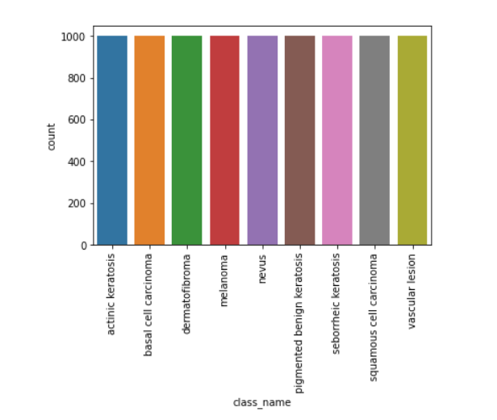
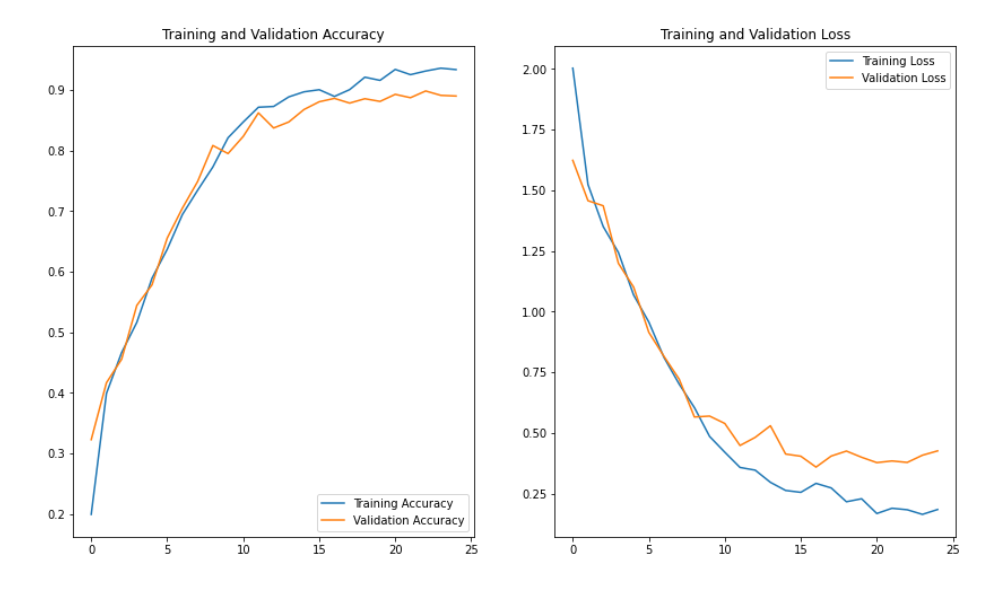

# Skin Cancer Detection using CNN 🩺🔬

## 🎯 Problem Statement

Melanoma is a deadly form of skin cancer that accounts for 75% of skin cancer deaths. Early detection is crucial for effective treatment. This project aims to develop a Convolutional Neural Network (CNN) based model that can accurately detect melanoma, potentially reducing the manual effort required in diagnosis.

## 📊 Project Overview

### Dataset
- **Source**: Skin Cancer ISIC Dataset
- **Content**: Multiple types of skin cancer images
- **Objective**: Develop an AI-powered diagnostic tool for early melanoma detection

## 🚀 Project Journey and Findings

### Initial Model Development

#### 🔍 Standard Model Findings
- **Overfitting Detected**: 
  - Significant accuracy difference between training and validation data (approximately 20%)
  - Training accuracy limited to 70-75% even after 25 epochs
  - Potential data imbalance causing model bias

 

### Data Augmentation Approach

#### 🛠 Data Augmentation Findings
- **Overfitting Mitigation**:
  - Reduced train-validation accuracy difference from 20% to 2-3%
  - Model accuracy temporarily compromised
  - Identified clear scope for further improvement



### Class Balancing Strategy

#### ⚖️ Resampled Model Findings
- **Significant Improvements**:
  - Model accuracy raised to 90%
  - Overfitting problem substantially addressed
  - Train and validation set difference reduced to 4-5%

 

 

## 🏆 Key Takeaways

1. **Initial Challenge**: High overfitting and limited accuracy
2. **Strategy**: 
   - Implemented data augmentation
   - Addressed class imbalance
3. **Outcome**: Robust model with 90% accuracy and minimal overfitting

## 🔬 Technical Details

### Model Architecture
- **Type**: Convolutional Neural Network (CNN)
- **Key Techniques**:
  - Data Augmentation
  - Class Resampling
  - Dropout Layers

### Performance Metrics
- **Initial Accuracy**: 70-75%
- **Final Accuracy**: 90%
- **Overfitting Reduction**: From 20% to 4-5% gap

## 🚧 Future Improvements

- Further hyperparameter tuning
- Exploring advanced augmentation techniques
- Investigating ensemble methods
- Collecting more diverse training data

## 📦 Installation

```bash
# Clone the repository
git clone https://github.com/yourusername/skin-cancer-detection.git

# Install required dependencies
pip install -r requirements.txt

# Run the notebook
jupyter notebook skin_cancer_detection.ipynb
```

## 🤝 Contributing

Contributions, issues, and feature requests are welcome! Feel free to check [issues page](https://github.com/yourusername/skin-cancer-detection/issues).


## 🙏 Acknowledgments

- ISIC Dataset Providers
- Open-source Machine Learning Community
- Medical Professionals Worldwide

---

**Disclaimer**: This is a research project and should not replace professional medical diagnosis. Always consult healthcare professionals.
